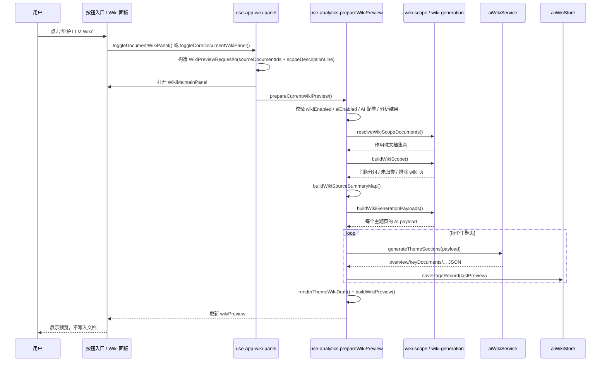
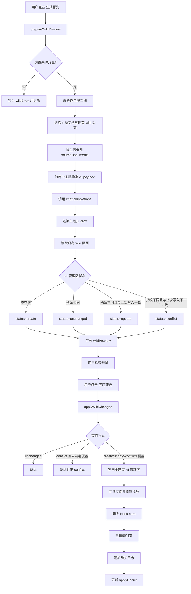

# 当前“维护 LLM Wiki”按钮操作流程分析

## 1. 结论先行

当前仓库里同名的“维护 LLM Wiki”入口有两类，但后续处理链路基本一致，核心区别只在“分析范围”的来源：

1. 文档样本范围入口
   - 位于主界面文档详情区域下方。
   - 点击后会以当前 `filteredDocuments` 作为源文档集合生成一轮 Wiki 预览。
2. 核心文档关联范围入口
   - 位于排行详情里的单个核心文档卡片下方。
   - 点击后会以“当前文档 + 出链 + 入链 + 子文档”的去重集合作为源文档集合生成一轮 Wiki 预览。

这两个按钮点击后都不会直接写入思源文档，而是先打开 `WikiMaintainPanel` 并自动执行一次“生成预览”。真正写回主题 wiki 页、索引页、维护日志页，要等用户再次点击“应用变更”。

## 2. 入口与前置条件

### 2.1 入口挂载位置

- `src/App.vue`
  - 当 `selectedSummaryDetail?.key === 'documents'` 且 LLM Wiki alpha 功能未隐藏时，显示主入口按钮。
- `src/components/RankingPanel.vue`
  - 当 `showWikiPanelActions` 为真时，在排行项卡片内显示同名按钮。
- `src/composables/use-app-wiki-panel.ts`
  - 负责两类入口的面板开关、作用域请求构造、首次预览触发。

### 2.2 可见性与可执行前置条件

按钮和后续流程受两层约束：

1. 功能可见性
   - `isAlphaSettingVisible('llm-wiki')` 为真时，入口才会展示。
2. 运行前置条件
   - `wikiEnabled = true`
   - `aiEnabled = true`
   - AI 配置完整，至少有 `Base URL`、`API Key`、`Model`
   - 当前分析数据已完成刷新，即 `snapshot`、`report`、`trends` 都已就绪
   - `aiWikiService` 与 `aiWikiStore` 已初始化

如果不满足条件，面板会给出错误或空状态提示，不会进入 AI 生成。

## 3. 分析范围

### 3.1 文档样本范围

主界面里的“维护 LLM Wiki”点击后，会构造：

- `sourceDocumentIds = filteredDocuments.map(document => document.id)`
- `scopeDescriptionLine = '- Scope source: current doc sample'`

这里的 `filteredDocuments` 不是全库文档，而是已经经过当前筛选器收敛后的文档样本，因此它会受到这些条件影响：

- 时间窗口
- 笔记本筛选
- 标签筛选
- 主题筛选
- 关键词筛选

### 3.2 核心文档关联范围

排行项里的“维护 LLM Wiki”点击后，会构造：

- 当前核心文档自身
- `outbound`
- `inbound`
- `childDocuments`

然后去重，形成：

- `sourceDocumentIds = [...new Set([...])]`
- `scopeDescriptionLine = '- Scope source: related range for core doc "<标题>" (outbound / inbound / child docs)'`

所以这个入口不是“全局当前筛选结果”，而是“围绕一个核心文档的局部关联范围”。

### 3.3 真正进入 Wiki 分析的文档集合

`prepareWikiPreview` 不会直接使用按钮传入的 ID 列表，而是会先通过 `resolveWikiScopeDocuments` 把 ID 解析成真正的 `DocumentRecord`：

- 优先从 `associationDocumentMap` 取
- 取不到再从 `documentMap` 取
- 如果请求为空，则回退到 `filteredDocuments`

### 3.4 进入主题分组前的过滤规则

`buildWikiScope` 会把作用域文档再拆成三类：

1. 主题文档
   - 来自当前主题文档配置匹配结果。
   - 这些文档本身不会作为源文档参与主题页生成。
2. 现有 wiki 页面
   - 通过标题是否以 `wikiPageSuffix` 结尾来识别。
   - 这些页面会被放入 `excludedWikiDocuments`，不会进入本轮生成。
3. 普通源文档
   - 既不是主题文档，也不是 wiki 页面，才会进入 `sourceDocuments`。

### 3.5 主题归组规则

普通源文档会通过 `countThemeMatchesForDocument` 按主题文档名称匹配打分。

当前选择规则是：

- 总是取第一名主题作为主归属
- 如果第二名主题分数 / 第一名主题分数 >= `0.8`，则允许进入第二主题
- 没有任何命中主题的文档进入 `unclassifiedDocuments`

这意味着一篇文档最多进入两个主题组，不是无限多标签归属。

## 4. 点击后的交互步骤

### 4.1 第一次点击

点击“维护 LLM Wiki”后：

1. 如果当前面板已打开，则直接关闭面板并清空当前核心文档标记。
2. 如果当前面板未打开，则：
   - 生成当前入口对应的 `WikiPreviewRequest`
   - 记录到 `activeWikiPreviewRequest`
   - 打开 `WikiMaintainPanel`
   - 立即调用 `prepareCurrentWikiPreview()`

### 4.2 面板中的交互控件

`WikiMaintainPanel` 当前提供这些操作：

1. `生成预览`
   - 基于当前 `activeWikiPreviewRequest` 重新跑一遍预览。
2. `应用变更`
   - 只有存在可写页面时才可点击。
   - 默认只处理 `create` / `update` 页面。
3. `允许覆盖冲突页面`
   - 勾选后，`conflict` 页面也可被强制写回。

### 4.3 预览态展示

生成预览后，面板会显示：

1. 作用域摘要卡片
   - 命中源文档数
   - 命中主题数
   - 被排除的 wiki 页面数
   - 未归类来源数
2. 作用域描述行
   - 范围来源
   - 时间窗口
   - 笔记本
   - 标签
   - 主题
   - 关键词
3. 主题页预览卡片
   - 目标 wiki 页标题
   - 配对主题页
   - 状态
   - 源文档数
   - 受影响 section
   - 是否已有人工备注区
   - 旧摘要
   - 新摘要
   - 冲突原因
4. 未归类来源列表

### 4.4 应用后的结果态展示

写入完成后，面板继续展示：

- 本轮 created / updated / skipped / conflict 汇总
- 打开索引页
- 打开维护日志页
- 打开最近更新主题页

## 5. 具体处理流程

### 5.1 预览生成主链路

`prepareWikiPreview` 的处理顺序如下：

1. 校验 LLM Wiki 开关、AI 开关、AI 配置、分析结果、服务实例、存储实例。
2. 生成 `generatedAt = new Date().toISOString()`。
3. 解析本轮作用域文档集合。
4. 调用 `buildWikiScope` 生成：
   - `sourceDocuments`
   - `themeGroups`
   - `unclassifiedDocuments`
   - `excludedWikiDocuments`
   - `summary`
5. 调用 `buildWikiScopeDescriptionLines` 生成当前预览头部说明。
6. 调用 `buildWikiSourceSummaryMap` 为每个 `sourceDocument` 准备摘要输入。
7. 调用 `buildWikiGenerationPayloads` 把主题组、结构信号、证据拼成每个主题页的 AI Payload。
8. 对每个主题并发调用 AI 生成 section JSON。
9. 调用 `renderThemeWikiDraft` 把 AI 输出渲染成稳定 markdown 草稿。
10. 读取目标 wiki 页现状，构建 diff 预览。
11. 把本轮预览结果落入 `wikiPreview`，供面板展示。

### 5.2 源文档摘要不是由 LLM 现算

这一点很关键：LLM Wiki 的主题页 section 是 AI 生成的，但传给 AI 的单篇源文档摘要当前不是实时 LLM 总结，而是 `ensureDocumentSummary` 的本地摘要结果。

当前摘要来源是确定性规则：

- `summaryShort`
  - 取文档正文压平后的前 120 个字符
- `summaryMedium`
  - 标题、路径、前两条内容证据的拼接
- `keywords`
  - 标签 + 标题拆词
- `evidenceSnippets`
  - 正文前两行的去重结果

这些摘要会缓存到 AI 索引存储里，但不是通过 `chat/completions` 额外生成。

### 5.3 AI 主题页生成输入

`buildWikiGenerationPayloads` 给每个主题页生成的 payload 主要包括：

- `themeName`
- `pageTitle`
- `themeDocumentId`
- `themeDocumentTitle`
- `sourceDocuments`
  - 每篇文档的标题、短摘要、中摘要、关键词、证据片段、更新时间
- `signals`
  - `coreDocuments`
  - `bridgeDocuments`
  - `propagationDocuments`
  - `orphanDocuments`
  - `risingDocuments`
  - `fallingDocuments`
- `evidence`
  - 同主题源文档之间的引用证据字符串，格式接近：
    - `源标题 -> 目标标题：引用内容`

所以 AI 看到的是“主题页上下文 + 文档摘要 + 结构角色 + 原始关系证据”的混合包，而不是只给一堆原始 markdown。

### 5.4 预览 diff 与冲突判定

每个主题页草稿生成后，会先读取现有 wiki 页面并做预览判定：

- `create`
  - 页面不存在
- `update`
  - 页面存在，且 AI 管理区指纹与本轮草稿不同
- `unchanged`
  - 页面存在，且 AI 管理区指纹完全一致
- `conflict`
  - 页面存在，且当前 AI 管理区指纹不等于插件上次写入时记录的 `managedFingerprint`

当前冲突检测只看“AI 管理区”，不看人工备注区。这意味着：

- 用户改了人工备注区，不会触发冲突
- 用户或外部流程改了 AI 管理区，就会被识别为冲突

另外，预览阶段就会把每个页面的最新预览快照写入 `ai-wiki-index.json`，不是等到真正应用后才记录。

### 5.5 写回主链路

点击“应用变更”后，`applyWikiChanges` 会调用 `applyWikiDocuments`，处理顺序如下：

1. 逐个处理本轮主题页
   - `unchanged` 直接跳过
   - `conflict` 默认跳过，除非勾选“允许覆盖冲突页面”
   - `create` / `update` 执行真正写回
2. 写回主题页时：
   - 新页面：直接创建完整 markdown
   - 已有页面：只更新 `## AI managed area / ## AI 管理区`
   - 如果缺少人工备注区，则补一个 `## Manual notes / ## 人工备注`
3. 每次写后都会回读页面，重新计算指纹并更新 `ai-wiki-index.json`
4. 给主题页、索引页、日志页同步 block attrs
5. 重建索引页
6. 追加维护日志页本轮记录

### 5.6 索引页和日志页的生成方式

这两页都不是 AI 输出，而是本地规则生成：

1. 索引页
   - 基于 `ai-wiki-index.json` 里所有已记录的主题页快照重建
   - 会读取每个主题页正文里的“主题概览” section，抽取前 80 字作为索引摘要
   - 会同时列出未归类来源文档
2. 维护日志页
   - 采用 append-only 模式
   - 每次维护追加一个 `## <generatedAt>` 日志块
   - 记录本轮作用域说明、命中文档数、主题数、created/updated/skipped/conflict 数，以及触达页面清单

这里有一个很重要的实现细节：

- 主题页预览只覆盖“当前作用域内”的主题组
- 但索引页重建时会读取存储里“所有已有主题页记录”

所以索引页是全局累计视角，不是当前局部预览页数的简单镜像。

## 6. 输出样式

### 6.1 面板预览样式

当前面板输出是“摘要卡片 + 说明行 + 逐页预览卡片 + 应用结果”的管理面板样式，不直接渲染完整 markdown diff。

预览里主要展示的是：

- 页面级状态
- section 级受影响范围
- 旧摘要 / 新摘要
- 冲突原因

它更像“变更说明面板”，而不是文档全文预览器。

### 6.2 主题 wiki 页 markdown 样式

主题页最终写出的结构是稳定骨架：

```md
# <pageTitle>

## AI managed area

### Page meta
<配对主题页、生成时间、源文档数、模型名>

### Topic overview
<overview>

### Key documents
- ...

### Structure observations
- ...

### Relationship evidence
- ...

### Cleanup actions
- ...

## Manual notes

<人工备注保留区提示语>
```

几个关键点：

- section 顺序固定
- 数组型 section 会渲染成 markdown 列表
- 人工备注区始终保留，不由 AI 覆盖

### 6.3 索引页 markdown 样式

索引页是规则化摘要页，结构大致是：

```md
# <wikiIndexTitle>

## AI managed area

### 总览
- 更新时间
- 主题 wiki 页数
- 未归类来源数
- 本轮命中主题数

### 主题 wiki 页面
- <wiki页链接> | <主题页链接> | <概览摘要> | <源文档数> | <最近更新时间>

### 未归类来源
- <文档链接>

## Manual notes
...
```

### 6.4 维护日志页 markdown 样式

维护日志页采用时间追加样式：

```md
# <wikiLogTitle>

## <generatedAt>

- 范围来源...
- 时间窗口...
- 笔记本...
- 标签...
- 主题...
- 关键词...
- 命中源文档数...
- 命中主题数...
- 新建页面数...
- 更新页面数...
- 未变化页面数...
- 冲突页面数...

### 本次触达页面
- [Created] ...
- [Updated] ...
```

## 7. AI Prompt 设计

### 7.1 请求方式

主题页生成当前统一走：

- 端点：`<aiBaseUrl>/chat/completions`
- 方法：`POST`
- Header：
  - `Authorization: Bearer <aiApiKey>`
  - `Accept: application/json`
- 请求参数沿用全局 AI 配置：
  - `model`
  - `max_tokens`
  - `temperature`
  - `timeout`
  - `maxContextMessages`

### 7.2 System Prompt

当前 system prompt 是固定英文指令，核心约束是：

1. 你是思源笔记的 topic wiki maintenance assistant。
2. 基于 topic page、source document summaries、structure signals，为单个主题 wiki 页生成结构化 JSON。
3. 只返回 JSON，不要 markdown、解释或代码块。
4. JSON 必须包含：
   - `overview`
   - `keyDocuments`
   - `structureObservations`
   - `evidence`
   - `actions`
5. `overview` 必须是字符串，其余字段可以是字符串或字符串数组。
6. 不要编造不存在的文档、主题页、关系或证据。
7. 优先使用输入中的 `sourceDocuments`、`signals`、`evidence`。
8. 所有面向用户的文字要遵循当前工作区 UI 语言。

### 7.3 User Prompt

当前 user prompt 由 3 段自然语言指令加 1 段 JSON payload 拼接而成：

1. 结构化生成指令
   - 中文环境类似：
   - `请为主题 wiki 页面生成结构化内容。主题：{theme}。`
2. section 强调指令
   - `请突出主题概览、关键文档、结构观察、关系证据和整理动作。`
3. 保守输出指令
   - `如果某部分证据不足，可以保守输出“暂无明显...”而不是编造。`
4. `JSON.stringify(payload)`

也就是说，真正喂给模型的是“短提示词 + 完整结构化 payload”，而不是自由文本描述。

### 7.4 期望输出

模型期望返回的 JSON 形态是：

```json
{
  "overview": "string",
  "keyDocuments": ["string"],
  "structureObservations": ["string"],
  "evidence": ["string"],
  "actions": ["string"]
}
```

如果模型返回：

- fenced code block
- 外层说明文字
- 某些字段是单字符串

当前代码都会做兼容解析和归一化。

### 7.5 失败与兜底策略

模型输出进入 `normalizeThemeSections` 后，会做字段级兜底：

- `overview` 缺失 -> `暂无明显主题概览`
- `keyDocuments` 缺失 -> `暂无关键文档建议`
- `structureObservations` 缺失 -> `暂无明显结构观察`
- `evidence` 缺失 -> `暂无明显关系证据`
- `actions` 缺失 -> `暂无明确整理动作`

因此当前 Prompt 设计是明显偏“保守抽取式”的，不是鼓励模型自由发挥。

## 8. Mermaid 图示

### 8.1 点击到预览生成时序图



### 8.2 预览到写回处理流



## 9. 当前实现里最容易误解的点

### 9.1 按钮点击不会立即写文档

当前按钮点击只做两件事：

- 打开维护面板
- 自动生成预览

真正写回是面板里的第二次确认动作。

### 9.2 当前分析范围不是“全量知识库”

当前范围严格取决于入口：

- 主入口：当前筛选后的文档样本
- 排行入口：单个核心文档的关联局部范围

### 9.3 不是所有输出都来自 LLM

只有主题页的五个核心 section 来自 LLM。

下列内容都不是 LLM 直出：

- 单篇源文档摘要
- 页面 diff 预览
- 索引页
- 维护日志页
- 冲突检测
- block attrs 写入

### 9.4 当前预览不包含索引页和日志页全文预览

虽然最终应用时一定会更新索引页和日志页，但用户在面板预览阶段只能看到主题页级摘要，不会看到索引页和日志页的完整草稿。

## 10. 关键实现文件

- `src/App.vue`
- `src/components/RankingPanel.vue`
- `src/components/WikiMaintainPanel.vue`
- `src/composables/use-app-wiki-panel.ts`
- `src/composables/use-analytics.ts`
- `src/composables/use-analytics-wiki.ts`
- `src/analytics/wiki-scope.ts`
- `src/analytics/wiki-generation.ts`
- `src/analytics/wiki-ai.ts`
- `src/analytics/wiki-renderer.ts`
- `src/analytics/wiki-diff.ts`
- `src/analytics/wiki-documents.ts`
- `src/analytics/wiki-store.ts`
- `src/analytics/ai-document-summary.ts`

## 11. 一句话概括当前流程

当前“维护 LLM Wiki”按钮的真实语义不是“直接维护 Wiki”，而是“基于当前局部分析范围，先生成主题 wiki 页预览；用户确认后，再安全写回主题页，并同步重建索引页与追加维护日志页”。
